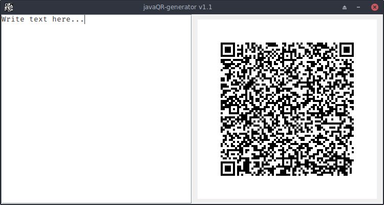

# javaQR-generator
A simple QR-code generator.

## Installation instructions.
**\*Note: In order to compile this program you must have jdk1.8 properly installed.**

To compile this program issue the following commands in a terminal session:
1. `git clone https://github.com/nikofabelo/javaQR-generator`
2. `cd javaQR-generator`
3. `./build-jar.sh`

Once you do this you'll get output javaQR-generator_v1.1.jar in the newly created dist folder. 
You can then run this output jar file by running the following command.
`java -jar dist/javaQR-generator_v1.1.jar`

## Screenshots.

## DISCLAIMER
FiraCode font (font.ttf file) is released under the [SIL Open Font License v1.1](http://scripts.sil.org/OFL).
